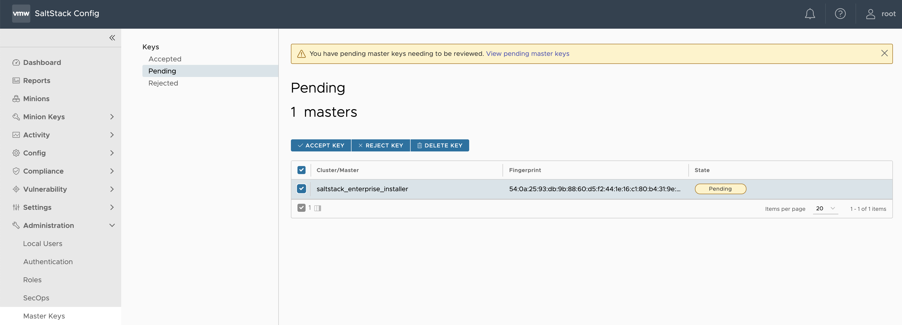
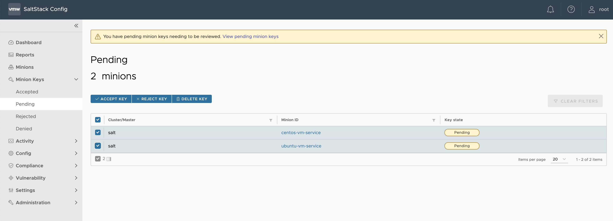
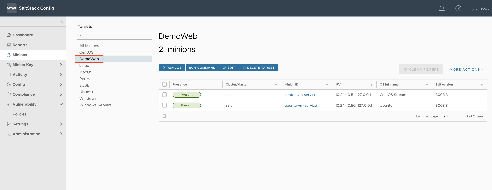
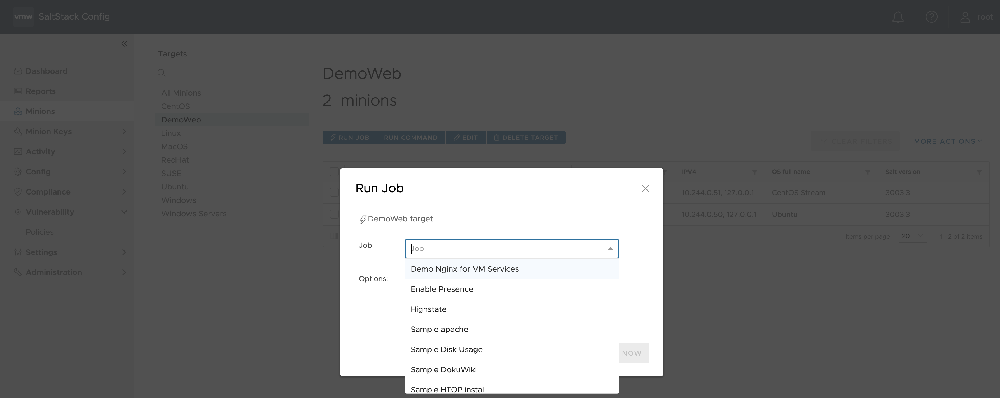
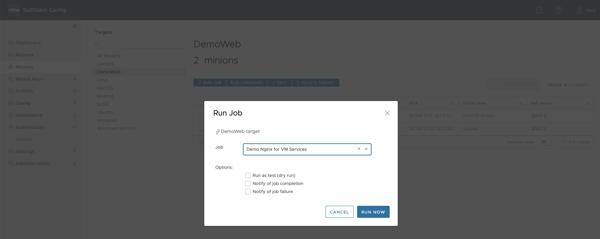

# vSphere VM Service automation with vRealize Automation SaltStack Config
This repo holds a collection of terraform scripts and other resources to show how you can use [vSphere with Tanzu VM Services](https://docs.vmware.com/en/VMware-vSphere/7.0/vmware-vsphere-with-tanzu/GUID-F81E3535-C275-4DDE-B35F-CE759EA3B4A0.html) and [vRealize Automation SaltStack Config](https://docs.vmware.com/en/VMware-vRealize-Automation-SaltStack-Config/index.html) together to deliver automated  deployment for vm-based workloads in cloud-native way.

After running the terraform scripts in this repo, you will get the following resources created for you:
* A SaltStack Config service with security automation add-on
* A demo SaltStack Job to automate the installation of Nginx on your VMs
* Two vSphere with Tanzu VM Services VMs with Salt minions connected to SaltStack Config


Prerequisites
-------------
### 1. Customer Connect profile
If you don't have a [Customer Connect profile](https://customerconnect.vmware.com/), you can sign up for a new one [here](https://customerconnect.vmware.com/account-registration). To download 

### 2. A vSphere with Tanzu VM Service Environment

Please refer to vSphere with Tanzu VM Service [documentation](https://docs.vmware.com/en/VMware-vSphere/7.0/vmware-vsphere-with-tanzu/GUID-F81E3535-C275-4DDE-B35F-CE759EA3B4A0.html) for more information. 


### 3. Install Terraform if it's not installed yet

Now, we need to install Terraform.  Instructions on that are [here](https://www.terraform.io/intro/getting-started/install.html).  Depending on which OS you run the installation is slightly different:

<details><summary>macOS</summary>

The easiest way is to install [brew](https://brew.sh/) and then used it to install Terraform with the commands:

```
/usr/bin/ruby -e "$(curl -fsSL https://raw.githubusercontent.com/Homebrew/install/master/install)"
sudo chown -R $(whoami) /usr/local/bin /usr/local/lib
brew install terraform
```

</details>

<details><summary>Linux</summary>

For installing on Linux, just run:

```
VERSION='0.11.10' # latest, stable version
wget "https://releases.hashicorp.com/terraform/"$VERSION"/terraform_"$VERSION"_linux_amd64.zip"
unzip terraform_0.11.10_linux_amd64.zip
sudo mv terraform /usr/local/bin/
sudo chown root:root /usr/local/bin/terraform
```

</details>

<details><summary>Windows</summary>

The easiest way to install Terraform and run other setup is to install [Chocolatey](https://chocolatey.org/), which is a package manager for windows.
You can then use Chocolatey to install Terraform and Git for Windows (which includes other needed tools).

Start powershell **as Administrator** and run the commands below. `choco` will prompt to install, press `Y` and enter.

```
Set-ExecutionPolicy Bypass -Scope Process -Force; [System.Net.ServicePointManager]::SecurityProtocol = [System.Net.ServicePointManager]::SecurityProtocol -bor 3072; iex ((New-Object System.Net.WebClient).DownloadString('https://chocolatey.org/install.ps1'))

choco install terraform
choco install git.install --params "/GitAndUnixToolsOnPath /NoAutoCrlf"
```

After this completes close this powershell. These commands have installed Terraform, git, and other utilities we'll use later.

</details>

Dependencies
------------

1. Download the **VMware vRealize Automation SaltStack Config 8.5 virtual appliance** from customer connect [here](https://customerconnect.vmware.com/downloads/details?downloadGroup=VRA-SSC-850&productId=1184&rPId=70960)
2. Download and unzip the **VMware vRealize Automation SaltStack SecOps License** from customer connect [here](https://customerconnect.vmware.com/downloads/details?downloadGroup=VRA-SSSO-840&productId=1184&rPId=70960). For more details about SaltStack SecOps click [here](https://docs.vmware.com/en/VMware-vRealize-Automation-SaltStack-Config/8.5/install-configure-saltstack-config/GUID-39650C9F-E343-4CDF-9E1E-1A0DFFDFAF61.html)
3. Place the files from Step 1 & 2 into the [artifacts](artifacts) folder
4. Confirm the association of a VM Content Library with your target Namespace in vSphere with Tanzu. For more details about this task click [here](https://docs.vmware.com/en/VMware-vSphere/7.0/vmware-vsphere-with-tanzu/GUID-613500AB-BF49-4BF4-85FB-71A4445AB309.html#GUID-613500AB-BF49-4BF4-85FB-71A4445AB309)

Deploy your resources
-------------
1. In your terminal window, change directory `cd` to the route of this repo
2. Rename or make a copy of [secrets.auto.tfvars.example](secrets.auto.tfvars.example) to `secrets.auto.tfvars`
```
mv secrets.auto.tfvars.example secrets.auto.tfvars
```
3. Put your vCenter password and your desired SaltStack Config SSH password in `secrets.auto.tfvars`
4. Update the vsphere provider in [providers.tf](providers.tf) with your parameters, specifically  

```
vsphere_server       = "10.213.128.14"
user                 = "administrator@vsphere.local"
```
5. Put the parameters from your vSphere environment in for ssconfig OVA [main.tf](main.tf)
```
datacenter = "Pacific-Datacenter"
cluster    = "Workload-Cluster"
datastore  = "vsanDatastore"
host       = "pacific-esxi-1.haas-444.pez.vmware.com"
network    = "DVPG-Management Network"

### appliance variables
vm_name     = "vrassconfig"
mgmt_ip     = "10.213.128.50" # the static ip of ssconfig service
default_gw  = "10.213.128.1"
dns_servers = "10.192.2.10,10.192.2.11"
```
6. Depending on vSphere with Tanzu networking setup either `nsx-t` or `vsphere-distributed`, comment out one vm modules blocks and make the required edits like `vsphere_namespace` or `vm_storage_class`
```
################## NSX-T Networking ##############
# module "centos_vm" {
#   source            = "./vm-service-module"
#   vm_name           = "centos-vm-service"
#   ssconfig_ip       = module.ssconfig.ssconfig_ip
#   vsphere_namespace = "demo"
# }
# module "ubuntu_vm" {
#   source            = "./vm-service-module"
#   vm_name           = "ubuntu-vm-service"
#   vm_image_name     = "ubuntu-20-1621373774638"
#   ssconfig_ip       = module.ssconfig.ssconfig_ip
#   vsphere_namespace = "demo"
# }
################## AVI Networking ###############
# module "centos_vm" {
#   source            = "./vm-service-module"
#   vm_name           = "centos-vm-service"
#   ssconfig_ip       = module.ssconfig.ssconfig_ip
#   vsphere_namespace = "demo"
#   vm_networking     = "vsphere-distributed"
#   vm_network_name   = "workload-1"
#   vm_storage_class  = "tanzu"
# }
# module "ubuntu_vm" {
#   source            = "./vm-service-module"
#   vm_name           = "ubuntu-vm-service"
#   vm_image_name     = "ubuntu-20-1621373774638"
#   ssconfig_ip       = module.ssconfig.ssconfig_ip
#   vsphere_namespace = "demo"
#   vm_networking     = "vsphere-distributed"
#   vm_network_name   = "workload-1"
#   vm_storage_class  = "tanzu"
# }
```
7. Grab a fresh token from your supervisor cluster and change your local kubectl config context to the desired vSphere Namespace
```
kubectl vsphere login --server=wcp.haas-444.pez.vmware.com \
-u administrator@vsphere.local \
--insecure-skip-tls-verify

# make your current kubectl context to the desired vSphere Namespace

kubectl config use-context demo

```
8. After finishing the previous steps, you can start provisioning your resources 
```
terraform apply
```
9. Note the ip address from the terraform output to access the nginx web server(s) in your browser 
```
Apply complete! Resources: 8 added, 0 changed, 0 destroyed.

Outputs:

centos_web_lb_ip = "10.212.131.5"
ubuntu_web_lb_ip = "10.212.131.4"
```

SaltStack Config
----------------

After provisioning all the required resource, we need to finish setting up SaltStack Config

1. Login to you SaltStack Config user interface `https://<satl_stack_config_ip>` e.g. `https://10.213.128.50`
2. Accept the Salt master’s key 
    * from the top left navigation bar, click the **Menu**, then select **Administration** to access the Administration workspace. Click the **Master Keys** tab.
    * from the side menu, click Pending to show a list of all pending master keys
    * check the box next to the master key to select it. Then, click Accept Key
    
3. Accept the minion keys
    * After you accept the master key, an alert appears indicating you have pending keys to accept. To accept these minion keys, go to **Minion Keys** > **Pending**
    * Check the boxes next to your minions to select them. Then, click **Accept Key**.
    
4. Run the **Demo Nginx for VM Service** Job to install Nginx on the VMs created using vSphere VM Services
    * select **Minions** form the side menu
    * click on **DemoWeb** from the target list
    * then click on **Run Job**
    
    * select **Demo Nginx for VM Service** Job from the drop-down list
    
    * then run the job by clicking on **Run Now**
    
5. For configuring and using SaltStack SecOps, please refer to this [documentation](https://docs.vmware.com/en/VMware-vRealize-Automation-SaltStack-Config/8.5/using-and-managing-saltstack-secops/GUID-03D3148D-9C3D-4930-B095-C19F362D78FA.html)      